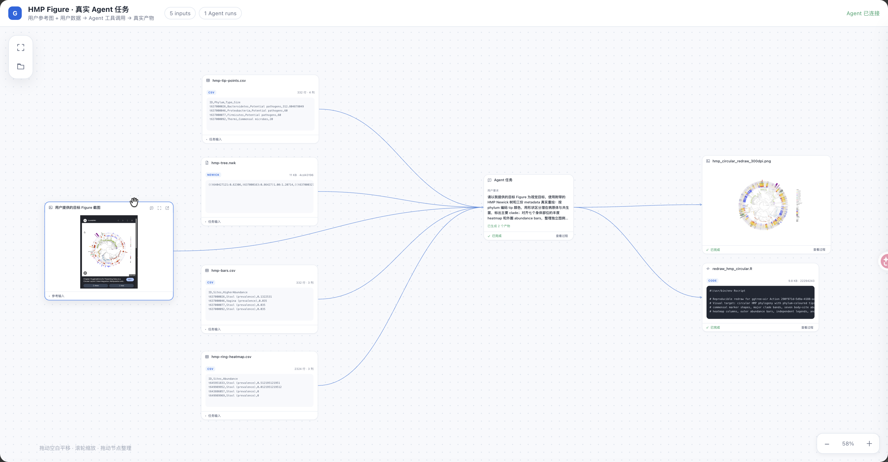

# ggtree-air

> **把系统发育树交给任意 Agent：它负责读数据、画图、打开节点画布，并持续处理你的点选、框选、涂鸦和文字修改，直到你满意。**



## Agent 一键接入

把下面整段复制到任意支持命令行和 Skill 的 Agent 对话窗口。Agent 会替你完成安装、环境检查、Skill 配置和首次使用；**不要自己执行里面的命令**。

```text
请阅读 https://github.com/xiayh0107/ggtree-air/blob/main/docs/agent-setup.md，严格按照文档为我安装并配置 ggtree-air。不要用 Context7 或通用 ggtree 文档替代项目文档；如果远程页面因私有仓库返回 404，先读取当前仓库的 `docs/agent-setup.md`，本地也不存在时应明确报告无访问权限而不是猜测。完成后请运行环境检查，安装或加载包内的 ggtree-phylo Skill；检查当前目录中的树和关联数据，创建只含真实输入的节点工作流并打开画布。必须使用与你当前客户端匹配的托管 Agent Bridge：Codex 使用 `--agent codex`，Claude Code 使用 `--agent claude`，Pi 使用 `--agent pi`；不要使用 `--agent none`，也不要运行长时间 `actions wait`，因为聊天客户端可能终止后台命令。请确认画布显示“Agent 已连接”，此后每个节点 Action 由 Bridge 启动独立 Agent 进程持续处理。除非遇到必须由我决定的科学问题，否则不要让我手动执行命令、选择端口或配置 R 环境。
```

GitHub 代码块右上角可以直接复制。

### 已经接入后的日常提示词

```text
使用 ggtree-phylo Skill 处理当前目录的系统发育树，以与你当前客户端匹配的 managed Agent Bridge 打开节点画布；不要使用 external/none 或后台 actions wait。确认画布显示 Agent 已连接，让 Bridge 持续处理我的节点反馈直到我满意。
```

Pi 也可以显式触发：

```text
/skill:ggtree-phylo 处理当前目录的系统发育树，并持续处理画布反馈直到我满意。
```

**用户不需要选择端口、记命令、写 R、理解 ggtree API，或者管理 revision。**

---

## 它是什么

ggtree-air 是一个让人和 Agent 围绕科研图片协作的节点画布。

```text
真实参考图 + 用户树与 metadata
   ↓
“请按参考图的视觉结构完成这张图”
   ↓
平台启动真实 Agent CLI；Agent 读取 Skill、输入和选区并调用工具
   ↓
经过提交校验的新产物
```

画布上只有两类内容：

- **Artifact**：真实图片或文件；
- **Action**：用户的原话和可选视觉选区。

程序本身不内置模型，也不假装理解绘图需求。它可以启动用户机器上已经安装并登录的 Agent CLI；任何其他 Agent 也可以加载同一 Skill，处理同一套 Action/Artifact 协议。

## 用户如何使用

### 1. 让 Agent 建立真实输入画布

你只需要描述目标：

```text
把这个目录里的树和 metadata 做成适合论文的图，自动选择合理布局并打开给我看。
```

Agent 会负责：

- 找到 Newick/NEXUS/PhyloXML、距离矩阵或 FASTA；
- 识别匹配的 metadata 和参考图；
- 创建空白任务画布并逐个导入这些真实输入；
- 打开浏览器，但不会提前生成无关布局或完成历史；
- 你在节点旁提交目标后，平台才启动真实 Agent Run。

### 2. 在产物旁直接说怎么改

点击输入或产物节点的“Agent 任务”，选择要交给 Agent 的上下文资源，再输入一句话：

```text
配色柔和一点。
色块太大，缩小一些。
标签挤在一起了，重新安排间距。
把这个 clade 突出，但不要遮住 support。
```

发送后会创建一个 Action 节点，并启动真实 Agent CLI。只有 Agent 通过协议提交了实际文件，画布才会出现下游 Artifact。

### 3. 需要时再标注

普通修改只需要一句话。

只有需要指出局部位置时才点击标注按钮：

```text
点选 | 框选 | 画笔
```

标注只是上下文附件；“怎么改”仍由自然语言表达。

### 4. 明确要求多个候选

默认一次 Action 只产生一个真正变化的产物。

当你明确说：

```text
试三个不同风格的配色。
分别给我一个保守版和一个展示版。
比较有标签和无标签两种方案。
```

同一个 Action 可以连接多个候选 Artifact：

```text
Action
 ├─ Candidate A
 ├─ Candidate B
 └─ Candidate C
```

### 5. 继续修改直到满意

从任意候选产物继续输入要求即可自然形成分支。旧产物不会被覆盖。

---

## Agent 工作时用户能看到什么

Action 节点会原地显示：

- 哪个 Agent 接收了任务；
- 当前阶段；
- 人类可读的进度文字；
- 进度条；
- 最近的执行步骤；
- 候选图片预览；
- 完成、失败或等待状态。

示例：

```text
正在检查源图和标注区域        15%
正在调整配色和图例层级        45%
已生成候选，正在检查重叠      75%
已提交 2 个产物              100%
```

节点提交后，后端会启动真实的本机 Agent CLI；若 Agent 不可用，Action 会诚实停在“等待 Agent”，不会生成假的结果。设置 `GGTREE_AIR_AGENT=none` 可关闭托管启动，改由任意外部 Agent 使用 `actions wait` 接单。

---

## 为什么任何 Agent 都能使用

安装包直接包含：

```text
ggtree-air/
├── skills/ggtree-phylo/   # 标准 Agent Skill
├── frontend/              # React + TypeScript + React Flow 人机协作画布
├── renderer/r/            # ggtree 科学绘图能力
├── backend/               # 中立 Action/Artifact 协议
└── examples/              # 可复现案例
```

Skill 使用普通文件和 CLI 协议，不绑定特定模型厂商或 Agent SDK。

支持 Skill 自动发现的 Agent 可以直接加载包内 Skill；其他 Agent 可以获取 Skill 路径或安装到自己的 Skill 目录。

---

## 从真实输入开始，而不是运行伪造 Demo

平台不再内置预先完成的 Demo 历史。Agent 或用户只负责创建空白任务画布、导入真实输入，然后由节点上的提示词启动真实 Agent Run：

```bash
ggtree-air workspace create --out results/my-task --title "复现并迁移这张系统发育图"
ggtree-air artifacts import --workspace results/my-task \
  --file reference.png --role reference
ggtree-air artifacts import --workspace results/my-task \
  --file tree.nwk --file metadata.csv --role user-input
ggtree-air open --workspace results/my-task
```

画布最初只显示这些真实输入，不生成多余的 rectangular/fan 结果。用户在节点旁输入要求并勾选上下文资源后，平台才创建 Action、启动本机 Agent CLI、记录真实工具调用，并在 Agent 提交经过校验的文件后创建输出节点。运行边界与防造假约束见 [`docs/AGENT_RUNTIME.md`](docs/AGENT_RUNTIME.md)。

### 通用 Agent Bridge

托管模式支持 Pi、Codex CLI 和 Claude Code：

```bash
ggtree-air open --workspace results/my-task --agent auto
ggtree-air open --workspace results/my-task --agent codex
ggtree-air open --workspace results/my-task --agent claude
```

`auto` 会探测安装、登录状态和 CLI 兼容性，并按 `pi,codex,claude` 顺序选择第一个可用 Agent。设置 `--agent none` 后，任意其他长期运行的 Agent daemon 仍可通过 `actions wait` 接入同一协议。Bridge 的 adapter/registry 设计见 [`docs/AGENT_BRIDGE.md`](docs/AGENT_BRIDGE.md)。

用户也可以直接在已有 Agent 会话窗口输入任务。该 Agent 应把原话发布到同一画布，而不是只在聊天中执行：

```bash
ggtree-air actions publish \
  --workspace results/my-task \
  --author codex-desktop \
  --instruction "根据分组表给树着色，并生成图片与可复现 R 脚本"
```

默认会附带工作区全部输入 Artifact。工作区服务的 Action inbox 会接收该任务并由 managed Agent 执行；画布显示“Agent 会话发布”Action、真实过程和输出节点。

---

## 安装

当前开发版本可以从源码安装：

```bash
npm install -g ./dist/ggtree-air-0.5.0.tgz
ggtree-air setup-r --with-recipes
ggtree-air skills install ggtree-phylo --agent pi --force
```

公开 npm/GitHub Release 的分发说明见 [`docs/DISTRIBUTION.md`](docs/DISTRIBUTION.md)。

---

<details>
<summary><strong>给 Agent 和集成开发者的协议入口</strong></summary>

### 创建并打开工作区

```bash
ggtree-air auto --input tree.nwk --metadata traits.csv --out results/tree
ggtree-air open --workspace results/tree
```

### 打开前端后保持等待

Agent 不应结束回合并要求用户回来手动通知，而应阻塞等待浏览器 Action：

```bash
ggtree-air actions wait \
  --workspace results/tree \
  --agent my-agent \
  --timeout 3600
```

浏览器提交后，命令立即返回并原子 claim 该 Action。

### 流式进度

```bash
ggtree-air actions running <id> --workspace results/tree --agent my-agent

ggtree-air actions progress <id> \
  --workspace results/tree \
  --agent my-agent \
  --phase preview \
  --percent 75 \
  --message "候选已生成，正在检查标签重叠" \
  --preview candidate.png
```

### 提交一个或多个真实产物

```bash
ggtree-air artifacts commit <id> \
  --workspace results/tree \
  --agent my-agent \
  --file candidate-a.png \
  --file candidate-b.png
```

### 失败时诚实返回

```bash
ggtree-air actions fail <id> \
  --workspace results/tree --agent my-agent \
  --message "无法从现有数据支持该修改"
```

### Skill

```bash
ggtree-air skills list
ggtree-air skills path
ggtree-air skills install ggtree-phylo --agent pi --force
```

Action/API Schema 位于 [`docs/schemas/`](docs/schemas/)。

</details>

---

## 科学边界

- NJ 默认是无根树，除非有明确 outgroup；
- branch length 代表输入距离，而不自动代表时间；
- 配色和 clade 标签是注释，不是统计证据；
- 有 bootstrap/posterior 时应展示支持度；
- topology 改变后必须重新验证 node id；
- FASTA/多序列比对质量决定下游树的可信度。

详细说明见 [`skills/ggtree-phylo/references/interpretation-guide.md`](skills/ggtree-phylo/references/interpretation-guide.md)。

## 开发状态

- 当前版本：`v0.5.0`
- 测试：Node、R、Playwright 全部通过
- npm audit：0 vulnerabilities
- 状态与边界：[`docs/STATUS.md`](docs/STATUS.md)
- 分发：[`docs/DISTRIBUTION.md`](docs/DISTRIBUTION.md)
